

    

一个基于 Spring Boot、MyBatis-Plus、MySQL、Redis、Docker、RabbitMQ 等技术栈实现的社区系统，拥有完整的文章&教程发布/搜索/评论/统计流程等。
  

## 一、项目介绍

### 项目演示

#### 首页

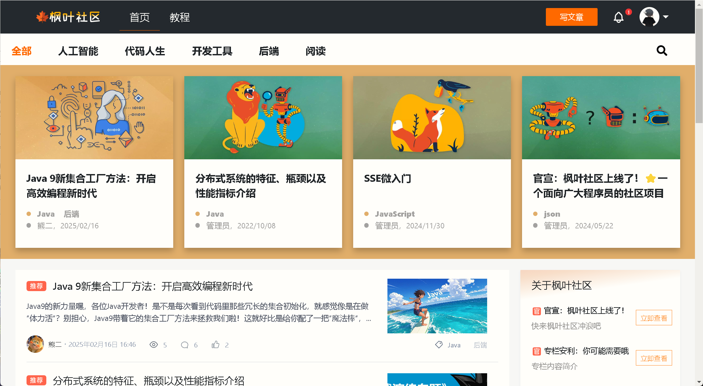

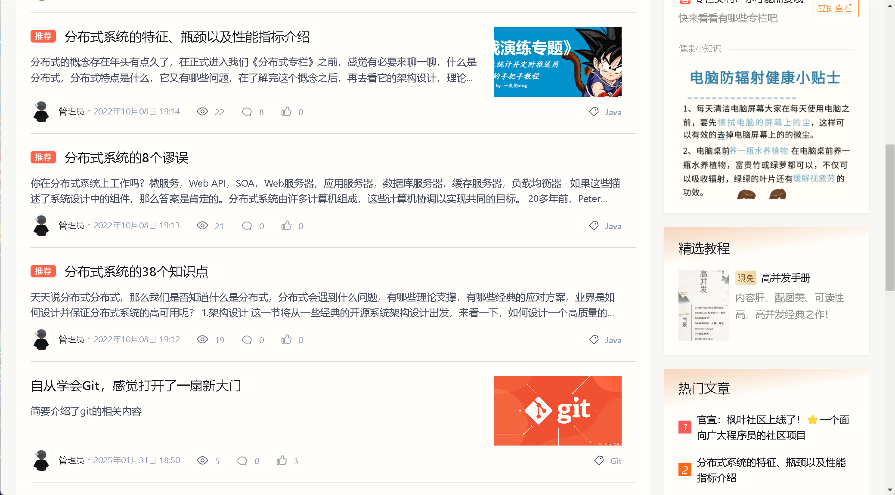

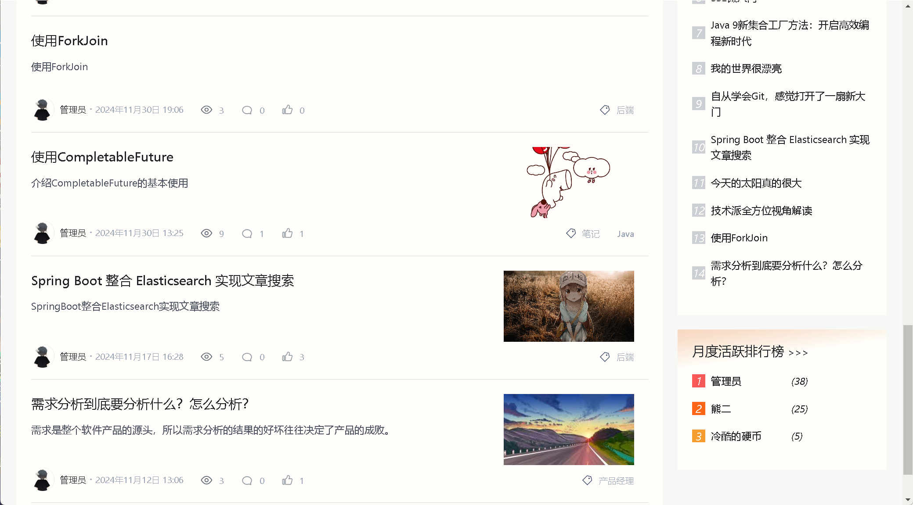

#### 文章详情页

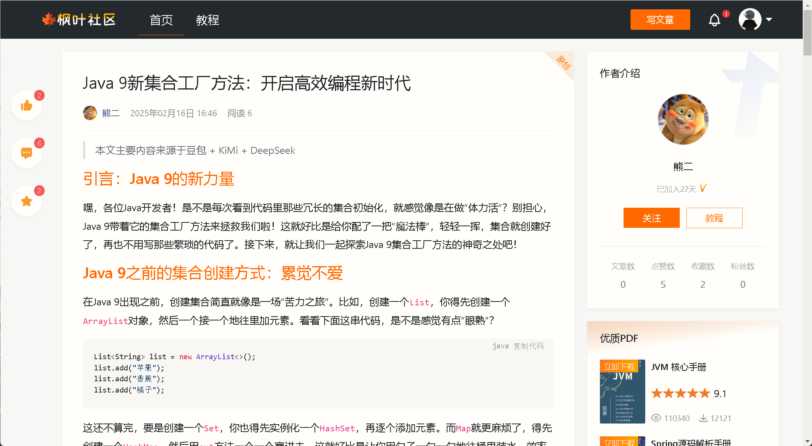

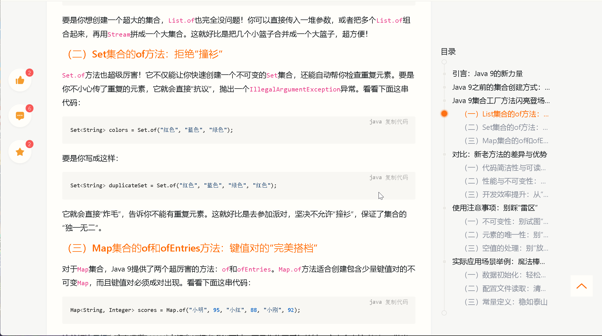

#### 评论页

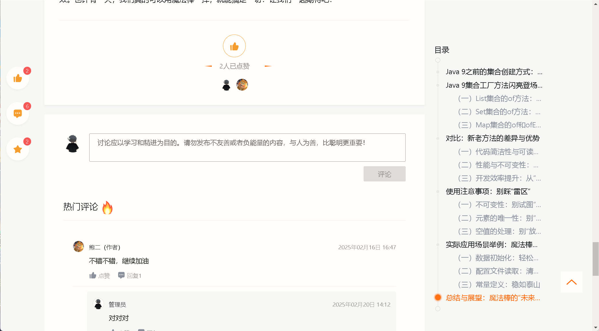

#### 搜索页

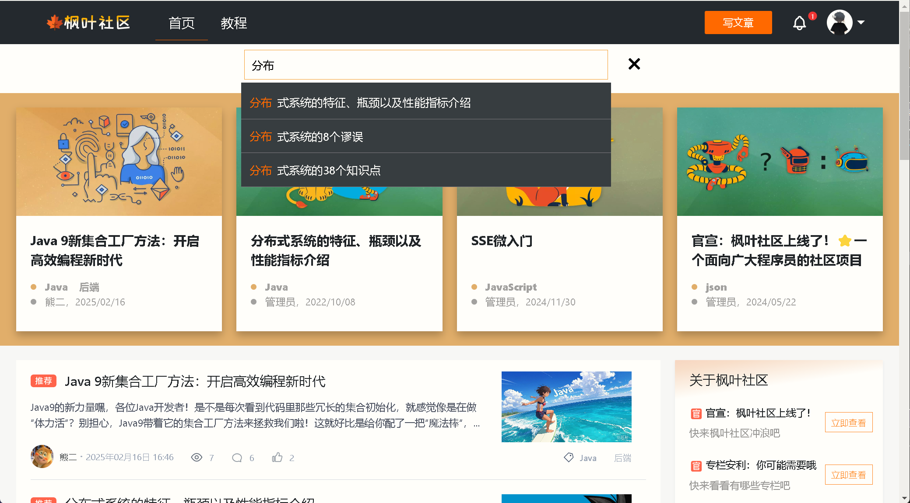

#### 登录页

#### 个人主页

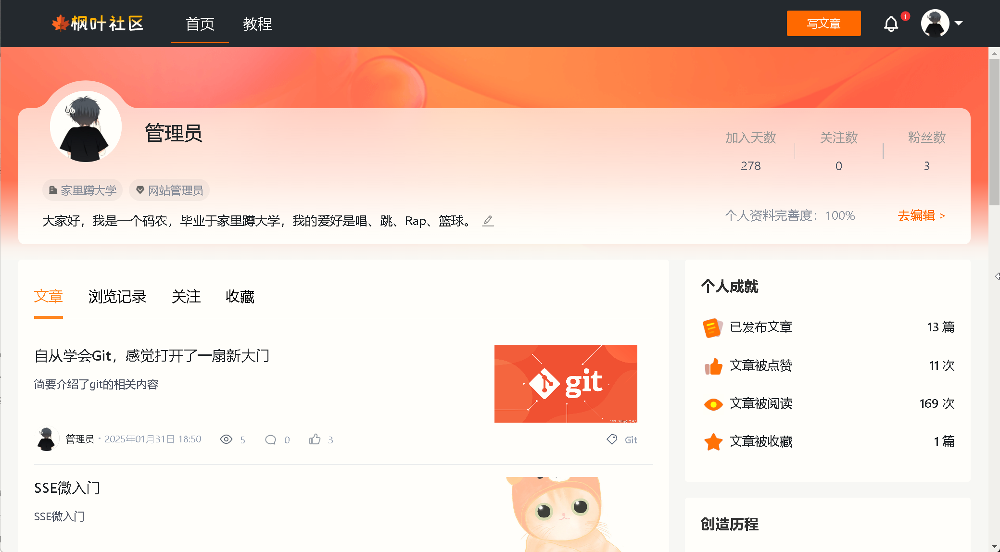

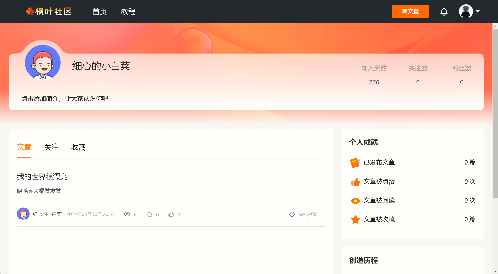

#### 通知页

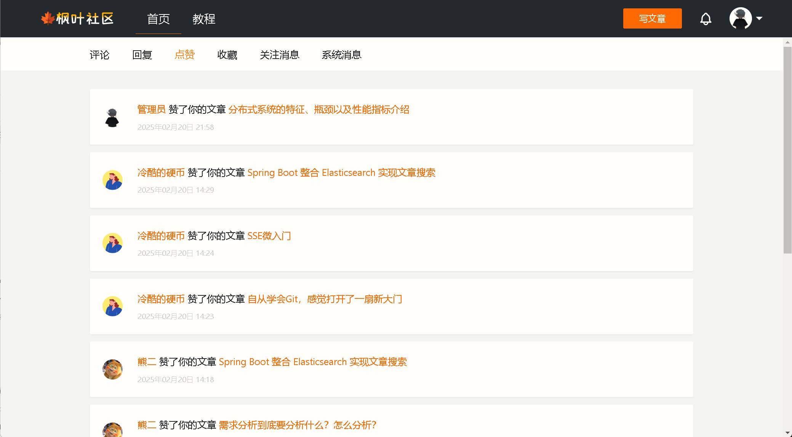

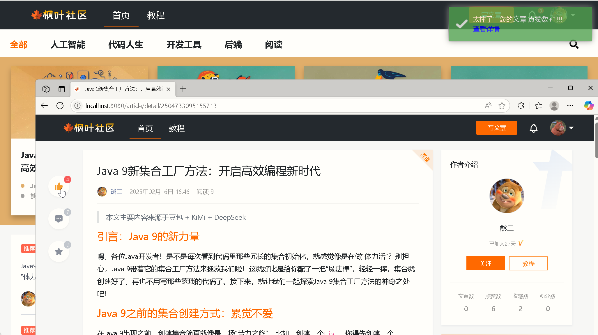

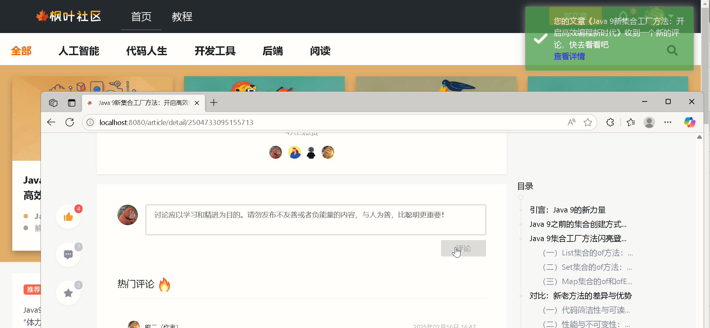

#### 专栏教程页

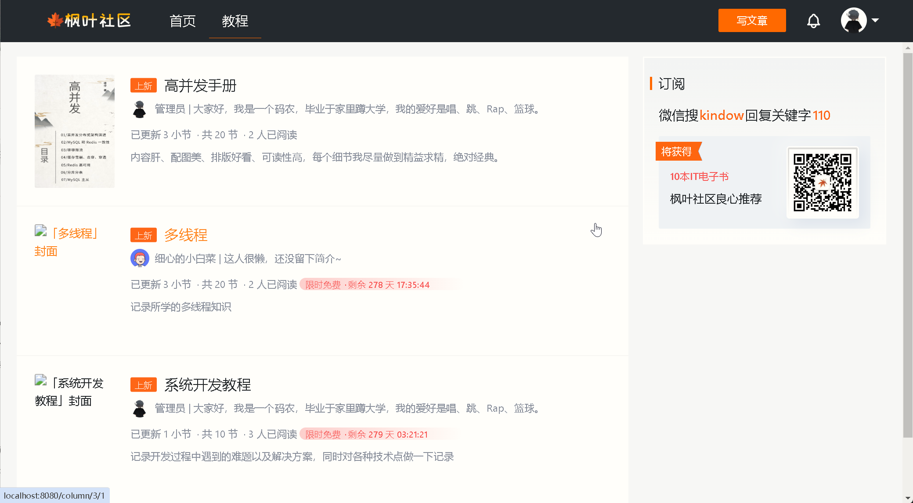

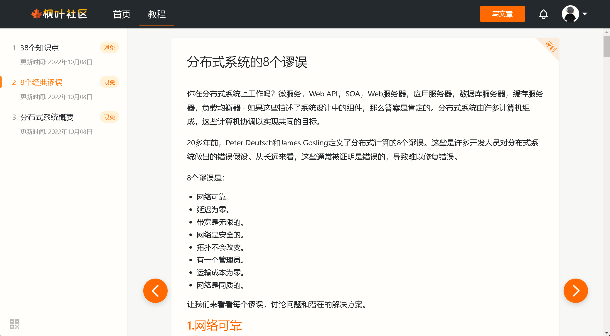
